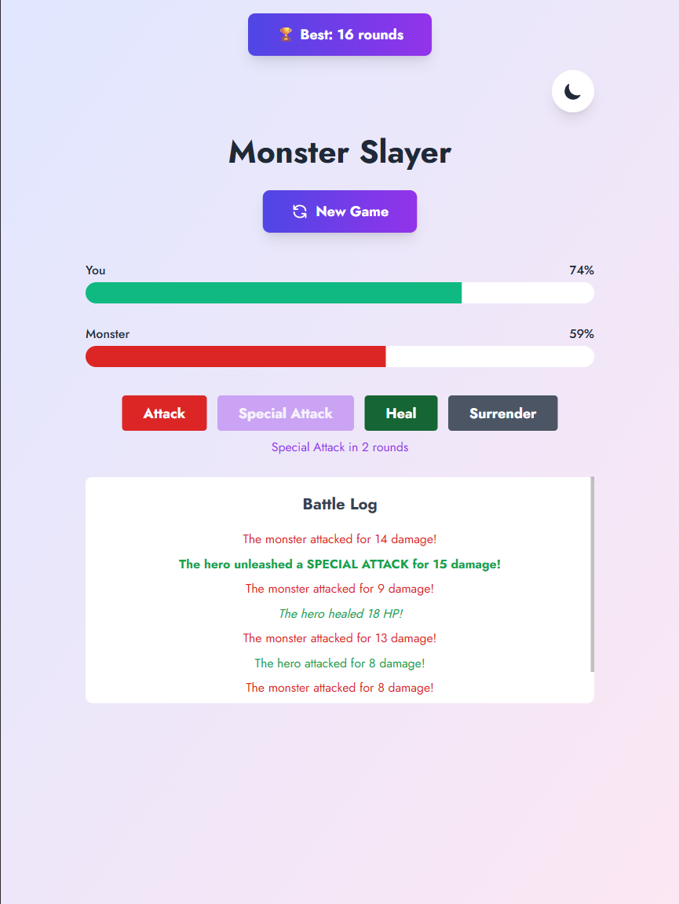
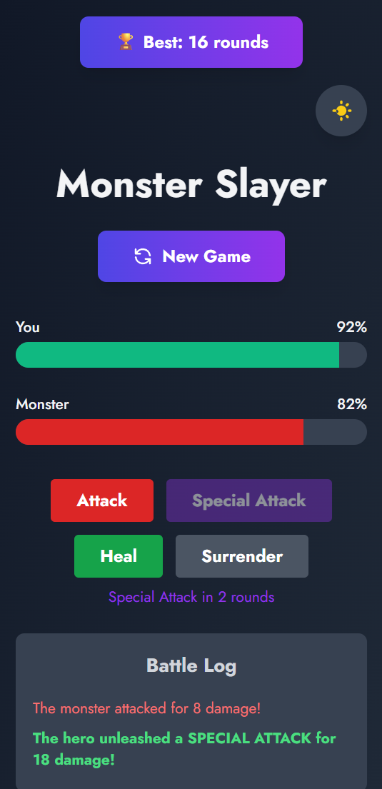
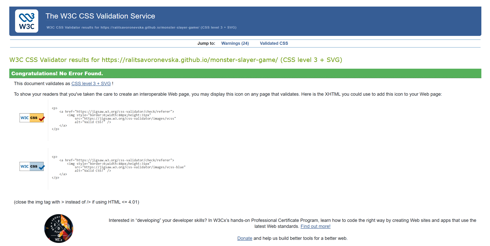
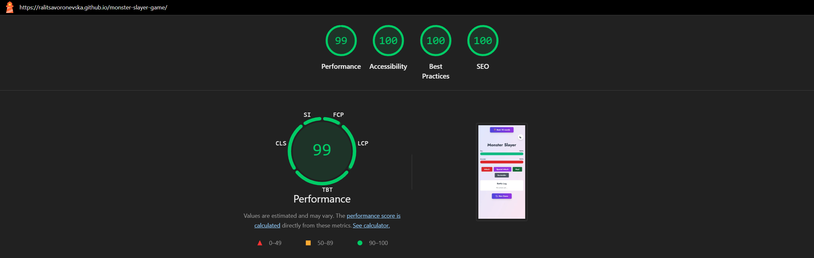
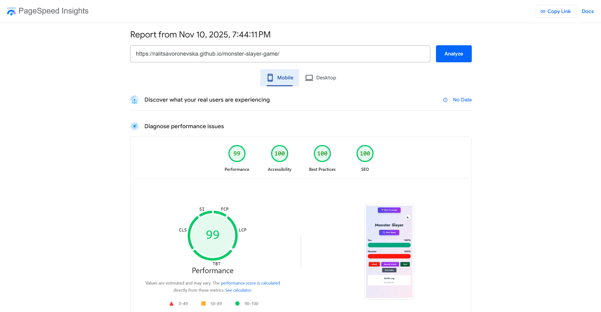

# 🚀👹🎮 Monster Slayer Game

📝 [CodePen](https://codepen.io/ralitsavoronevska/pen/gbPyXbV/)
🔗[Live GitHub Preview](https://ralitsavoronevska.github.io/monster-slayer-game/)

<details>
<summary>📸 Screenshots</summary>

## 🖥️ Desktop preview:


<table>
  <tr>
    <td colspan="2">📱 Tablet preview:</td>
  </tr>
  <tr>
    <td></td>
    <td></td>
  </tr>
</table>

<table>
  <tr>
    <td colspan="2">📱 Mobile Preview:</td>
  </tr>
  <tr>
    <td></td>
    <td></td>
  </tr>
 </table>

# 🏅 W3C HTML Validator


<br>

# 🏅 W3C CSS Validator


<br>

# 🌈 Chrome LightHouse Audit

Desktop:


<br>

Mobile:



<br>

# ⚡ PageSpeed Insights Results

Desktop:


<br>

Mobile:



</details>

<br>        
                                                                                                                                              
# 🛠️ Built with:

                                                                                                                                                
                                                                                                                                               
🔨 Fully Responsive, Mobile First Approach, Flex Layout, Transitions                                                    
⛏️ [Google Font: Jost](https://fonts.google.com/specimen/Jost/)                                                                  

# ✨ Features:
⚡ Vue 3 + Vite + TypeScript                                                                                                                         
🎨 Tailwind CSS v4                   
🍍 Pinia Game Store                                                                                                                 
🔊 Sound effects with Howler.js                                                                                                                     
🏆 High score (localStorage)                                                                                                                                      

# 🧰 Online resources and tools:                                                                                
🖼️ [Photopea [Online Photo Editor]](https://www.photopea.com/)        
<br>                                                                            

# 🌐 Browser Support:
(Last updated and tested: 10/11/2025)                                                                                                            
🌟 Chrome 142.0.7444.135 (64-bit)                                                                                                           
🦊 Firefox 144.0.2 (64-bit)                                                                                                                 
🏴‍☠️ Opera 123.0.5669.47 (64-bit)                                                                                                        
🪟 Edge 142.0.3595.69 (64-bit)                                                                                                                   

# 🧪 Online Validators:
✔️ [W3C HTML Validator](https://validator.w3.org/)                                                                                               
✔️ [W3C CSS Validator](https://jigsaw.w3.org/css-validator/)                                                                                     
💡 [LightHouse Audit](https://developers.google.com/web/tools/lighthouse/)                                                                       
⚡ [PageSpeed Insights Audit](https://pagespeed.web.dev/)         
⭐ [WebPageTest](https://www.catchpoint.com/webpagetest/)                                                                                                 


## Install
`cd` to project's dir and run `npm install`

## Vite builds
Vite is next Generation Frontend Tooling featuring unbundled web-development

## Hot-reloads for development
Start the development server on http://localhost:5137:
```bash
$ npm run dev
```

## Builds and minifies for production
```bash
$ npm run build
```

## Serves recently built app
```bash
$ npm run preview
```

<br>

# 🌟 Inspiration & Credits:                                          
▶️ [Vue - The Complete Guide (incl. Router & Composition API)](https://www.udemy.com/course/vuejs-2-the-complete-guide/)                      
🪄 [Grok 4](https://grok.com/)                
📢 [Sound effetcs from Pixaby](https://pixabay.com/sound-effects/)                                                                                                
🔊 [Audio Compressor](https://www.onlineconverter.com/audio/)                                                                                                    

---
  
🙌 Thanks for checking out my project! More coming 🔜.                                                                                           
Stay tuned 🚀 and don't forget to give the project a star!                                                                                       
⭐ Made with lots of 💗, ☕, and a sprinkle of ✨ by Ralitsa Voronevska!                                                                                