# 🚀👹🎮 Monster Slayer Game

I've built a game called "Monster Slayer Game" by following [Vue - The Complete Guide (incl. Router & Composition API)](https://www.udemy.com/course/vuejs-2-the-complete-guide/) Udemy course.

📝 [CodePen](https://codepen.io/ralitsavoronevska/pen/gbPyXbV/)
🔗[Live GitHub Preview](https://ralitsavoronevska.github.io/monster-slayer-game/)

<details>
<summary>📸 Screenshots</summary>

## 🖥️ Desktop preview:

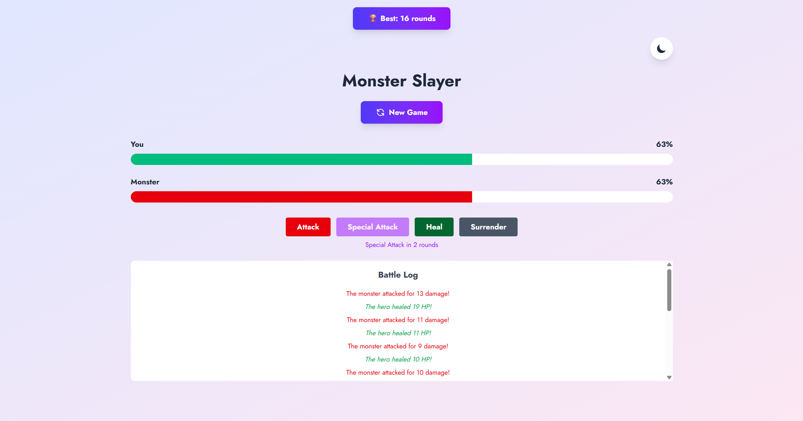
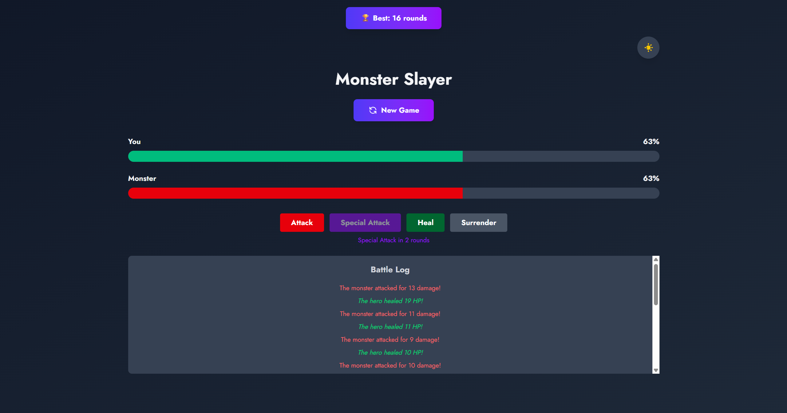

<table>
  <tr>
    <td colspan="2">📱 Tablet preview:</td>
  </tr>
  <tr>
    <td>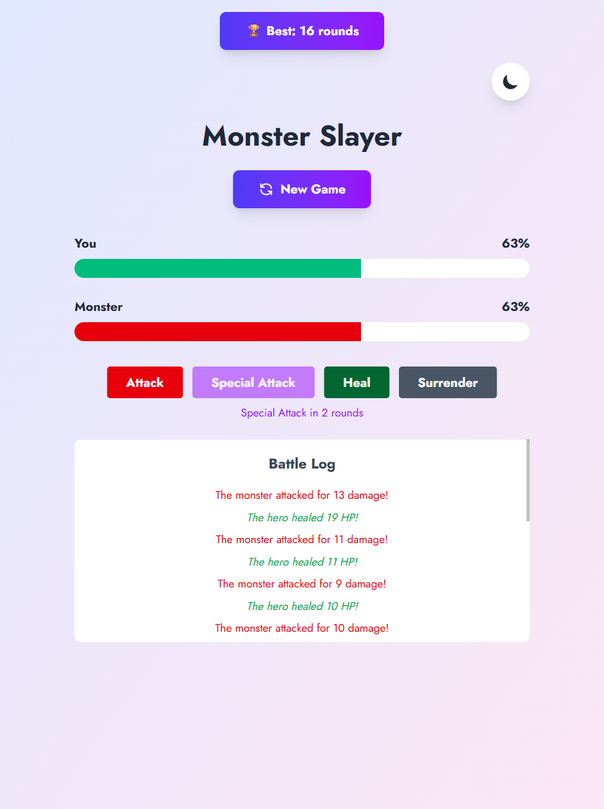</td>
    <td>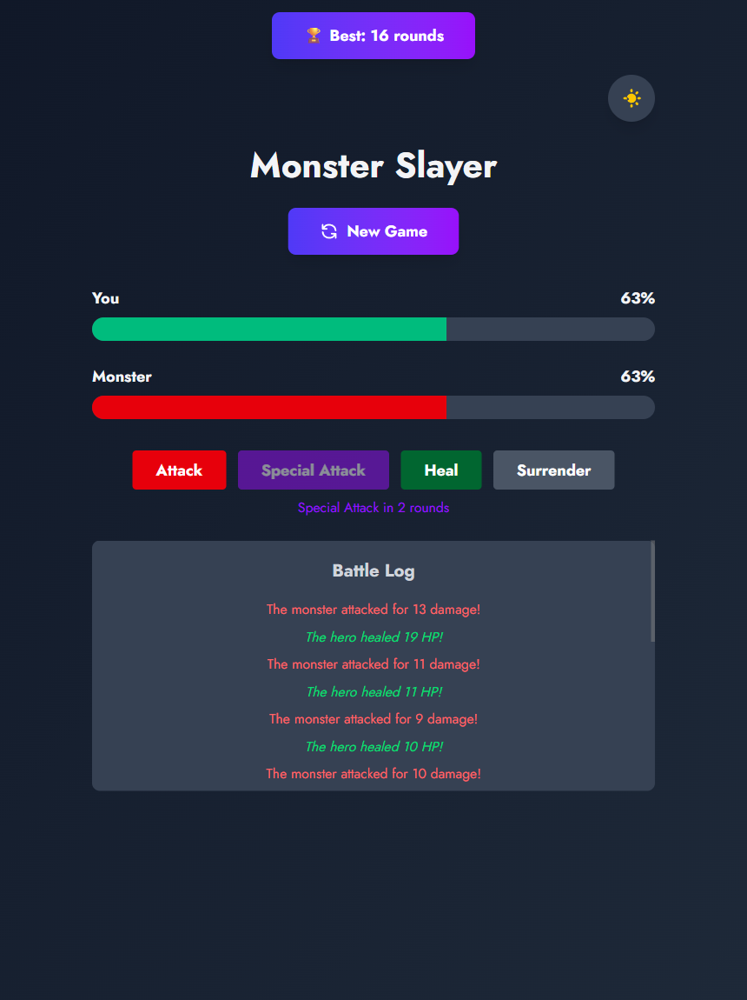</td>
  </tr>
</table>

<table>
  <tr>
    <td colspan="2">📱 Mobile Preview:</td>
  </tr>
  <tr>
    <td>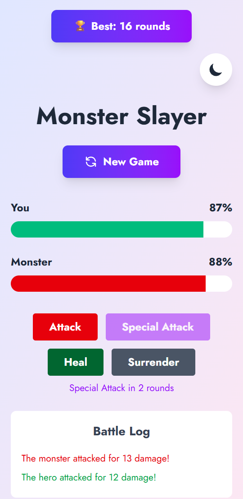</td>
    <td>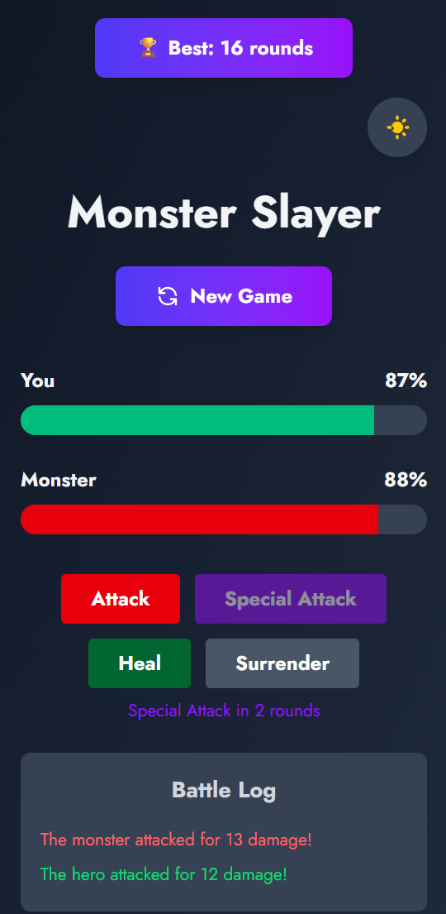</td>
  </tr>
 </table>

# 🏅 W3C HTML Validator

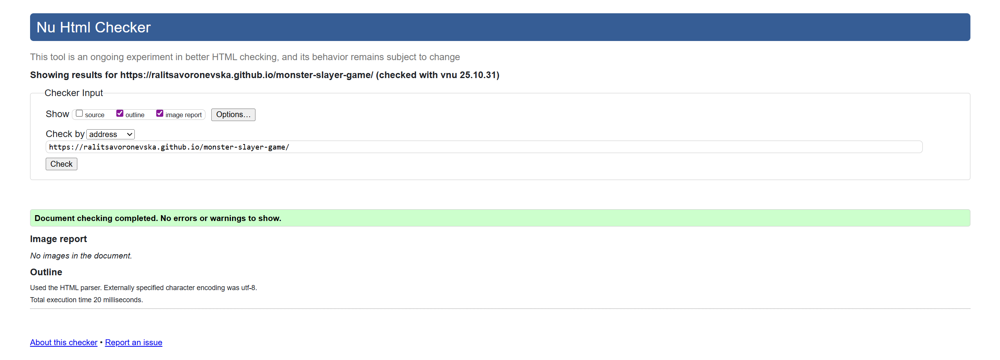

<br>

# 🏅 W3C CSS Validator

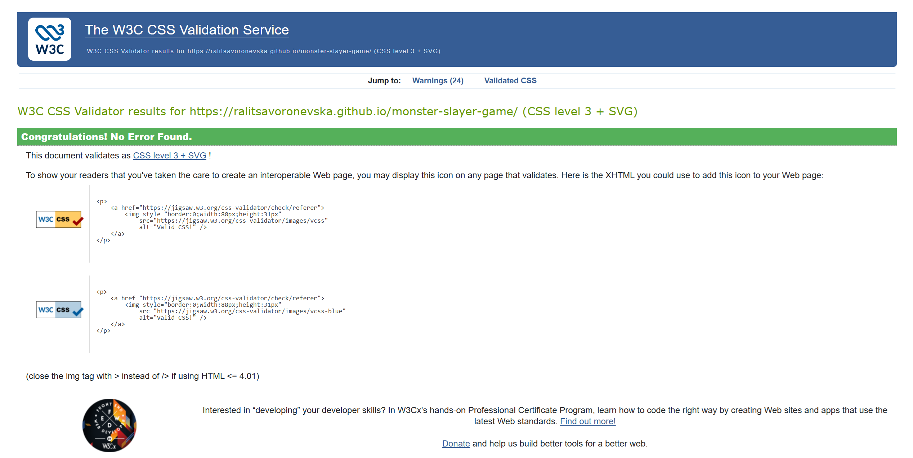

<br>

# 🌈 Chrome LightHouse Audit

Desktop:

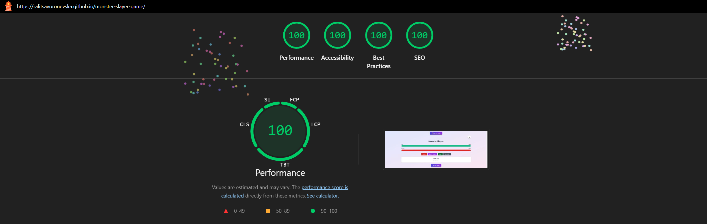

<br>

Mobile:

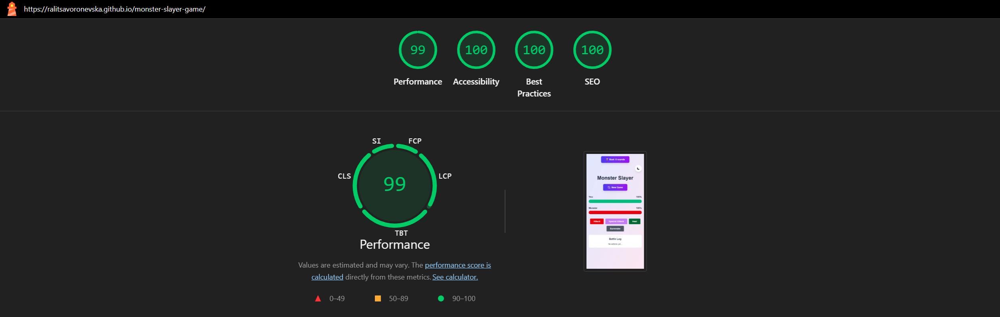

<br>

# ⚡ PageSpeed Insights Results

Desktop:

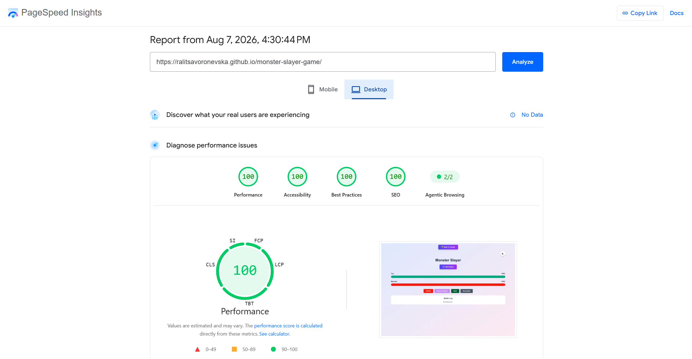

<br>

Mobile:

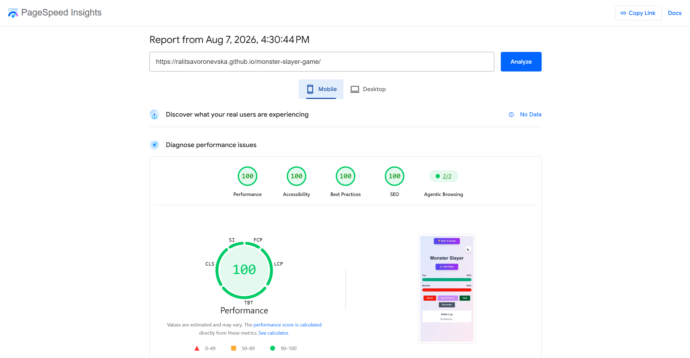

</details>

<br>        
                                                                                                                                              
# 🛠️ Built with:

                                                                                                                                                
    

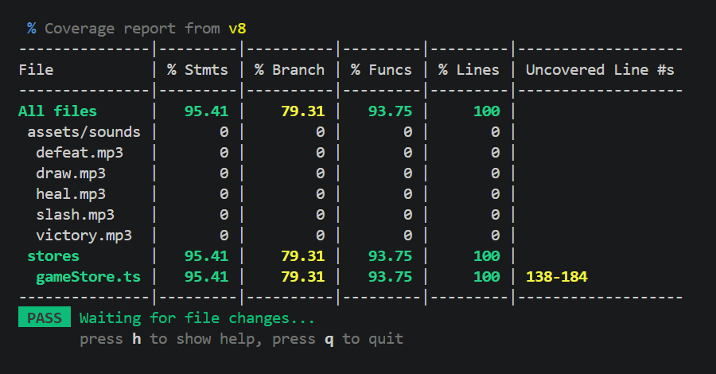

🔨 Fully Responsive, Mobile First Approach, Flex Layout, Transitions  
⛏️ [Google Font: Jost](https://fonts.google.com/specimen/Jost/)

<br>

# ✨ Features:

⚡ Vue 3 + Vite + TypeScript  
🎨 Tailwind CSS v4  
🍍 Pinia Game Store  
😶‍🌫️ Unit Tests with Vitest  
🔊 Sound effects with Howler.js  
🏆 High score (localStorage)

<br>

# 🧰 Online resources and tools:

🖼️ [Photopea [Online Photo Editor]](https://www.photopea.com/)

<br>

# 🌐 Browser Support:

(Last updated and tested: 07/08/2025)  
🌟 Chrome 151.0.7922.109 (64-bit)  
🦊 Firefox 153.0.3 (64-bit)  
🏴‍☠️ Opera 134.0.5954.46 (64-bit)  
🪟 Edge 151.0.4129.72 (64-bit)

<br>

# 🧪 Online Validators:

✔️ [W3C HTML Validator](https://validator.w3.org/)  
✔️ [W3C CSS Validator](https://jigsaw.w3.org/css-validator/)  
💡 [LightHouse Audit](https://developers.google.com/web/tools/lighthouse/)  
⚡ [PageSpeed Insights Audit](https://pagespeed.web.dev/)  
⭐ [WebPageTest](https://www.catchpoint.com/webpagetest/)

<br>

## Install

`cd` to project's dir and run `npm install`

<br>

## Vite builds

Vite is next Generation Frontend Tooling featuring unbundled web-development

<br>

## Hot-reloads for development

Start the development server on http://localhost:5137:

```bash
$ npm run dev
```

<br>

## Builds and minifies for production

```bash
$ npm run build
```

<br>

## Serves recently built app

```bash
$ npm run preview
```

<br>

# 🌟 Inspiration & Credits:

▶️ [Vue - The Complete Guide (incl. Router & Composition API)](https://www.udemy.com/course/vuejs-2-the-complete-guide/)  
🪄 [Grok 4](https://grok.com/)  
📢 [Sound effetcs from Pixaby](https://pixabay.com/sound-effects/)  
🔊 [Audio Compressor](https://www.onlineconverter.com/)

---

🙌 Thanks for checking out my project! More coming 🔜.  
Stay tuned 🚀 and don't forget to give the project a star!  
⭐ Made with lots of 💗, ☕, and a sprinkle of ✨ by Ralitsa Voronevska!
